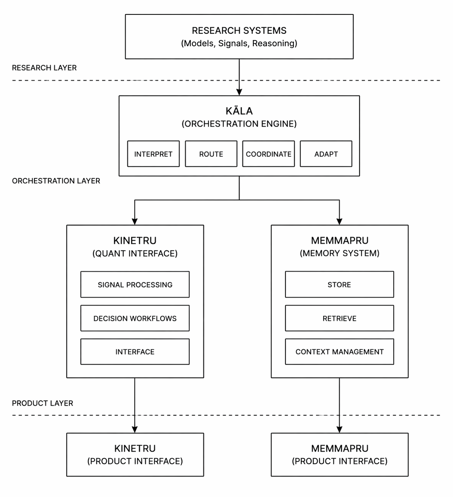

# RuruSystems

RuruSystems is an applied intelligence systems architecture focused on turning research into structured, usable systems.

---
## Why this matters

Most AI systems produce isolated outputs.

RuruSystems is designed to create structured intelligence that persists, evolves, and integrates across systems.

## System Overview

RuruSystems is built as a layered intelligence architecture:

- **Research Layer** — models, signals, and reasoning systems  
- **Kāla (Orchestration Layer)** — interprets, routes, and coordinates intelligence  
- **Product Layer** — exposes intelligence through usable interfaces  

---

## Architecture

Research Systems
↓
Kāla (Orchestration Engine)
↓

↓                                 ↓
Kinetru                      MemMapRu
(Quant Interface)           (Memory System)

---

## Core Systems

### Kāla
Orchestration layer responsible for:
- routing intelligence
- applying interpretation logic
- coordinating system behavior

### Kinetru
Quantitative intelligence interface:
- transforms signals into decision workflows
- structured, regime-aware outputs

### MemMapRu
Memory and context system:
- persistent interaction layer
- structured recall and continuity

---

## System Design Principles

- Separation of research, orchestration, and product layers  
- Modular and composable architecture  
- Runtime delivery abstraction  
- Long-term memory as a first-class system  
- Intelligence as structured output, not raw signals  

---

## System Flow

1. Research systems generate signals and models  
2. Kāla interprets and routes intelligence  
3. Runtime systems structure outputs  
4. Product interfaces expose usable workflows  

---

## Repository Structure

This repository serves as the **public architecture layer**.

It is used to document:
- system design
- architecture direction
- product relationships
- ecosystem structure  

---

## Related Systems

- [Kāla Engine](https://github.com/abhichkrbrty/kala-engine)
- [Kinetru](https://github.com/abhichkrbrty/kinetru)
- [Kinetru Runtime](https://github.com/abhichkrbrty/kinetru-runtime)
- [MemMapRu](https://github.com/abhichkrbrty/memmapru)

---

## Current Focus

- Designing orchestration across intelligence systems  
- Structuring runtime delivery layers  
- Scaling product interfaces from research systems  

---

## Code Access

Core implementations are partially maintained in private repositories.

This repository exists to expose:
- system architecture
- design thinking
- public-facing technical structure  

---

## Visual Overview

---

## Status

Active development and system expansion.
